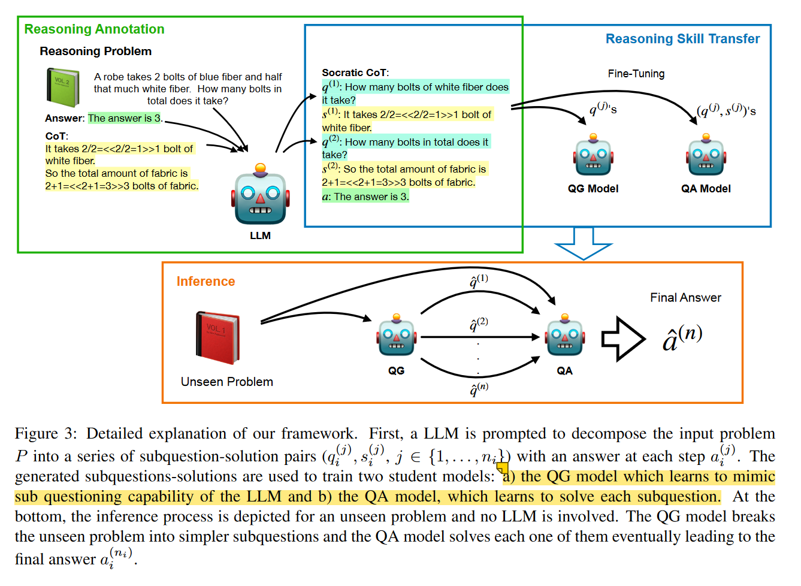
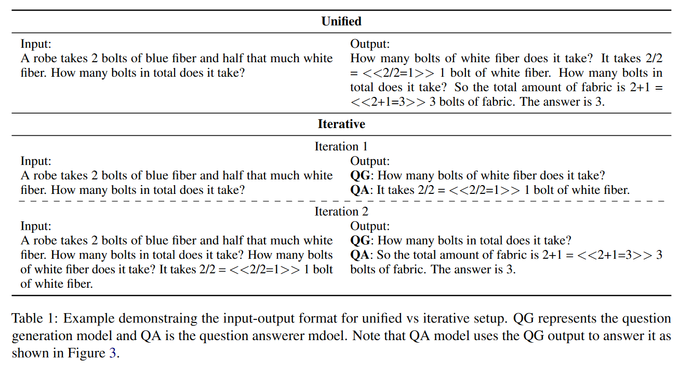
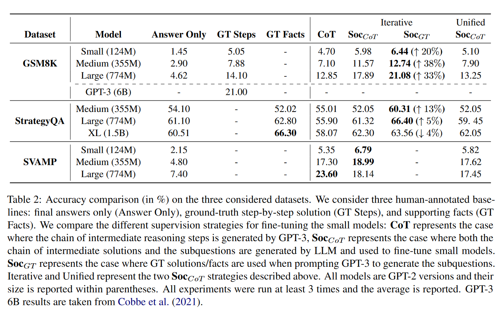

# Distilling Reasoning Capabilities into Smaller Language Models

## 问题与背景

CoT被证明在推理问题上表现出色，然而，CoT需要在数十亿个参数尺度的模型上才能发挥作用。之前也有工作尝试将逐步思考的注释数据（人工或llm生成）用于小模型的微调，由此小模型也能获取大模型的CoT推理的能力，这近似为教师-学生的知识蒸馏模型。因此，作者思考能够采用类似知识蒸馏的方式将大模型的推理能力转移到小模型上。

## 本文方法

本文提出了SOCRATIC CoT，首先对于一个待求解的问题Pi，在few shot prompt的设置下利用llm将其拆解成多个子问题q1,q2...qk和对应答案s1,s2...sk，然后会分别利用生成的多个子问题和对应答案去训练一个规模小得多的子问题生成模型QG和子问题求解模型QA。在实际推理的时候，QG和QA采用多步迭代的方式依此求解每个子问题来获得最终答案，即QG负责拆解问题生成子问题，然后在由QA多次迭代去依次解决子问题获得最终答案。整体框架如下：

在实际操作上，作者考虑了SOCRATIC CoT的两种设置：

考虑将子问题生成和子问题求解归为一个**统一**的模型来完成，即在给定了前k-1个子问题和对于子问题解答对$x_{j}^{:(k-1)}$的情况下生成第k个子问题和对于解答$x_{j}^{(k)}$：

$$
\mathcal{L}_j(P)=\quad-\sum_{k=1}^{m_j}\log\mathbb{P}_{uni}\:(x_j^{(k)}|x_j^{:(k-1)},P)
$$

考虑将子问题生成和子问题求解分为**两个模型**来完成，这也是本文主要的方法。对于子问题解决模型QA，它的回归建模目标如下：

$$
\mathcal{L}(P,s^{(j)})=-\sum_{k=1}^{l_{j}}\log\mathbb{P}_{\mathcal{QA}}\:(y_{j}^{(k)}|y_{j}^{(k-1)},q^{;(j)},s^{;(j-1)},P)
$$

即在得给定了原问题，当前已知的j个子问题q1,q2...qj和对应的前j-1个子问题的答案s1,s2...sj，该模型的回归目标为生成当前问题的答案sj，形式化定义如下，yj代表当前生成的答案sj的对应token。需要注意的的是，对于中间每一个子问题的答案都采用了**教师强制**的方式来矫正训练，**而在实际的推理过程中则采用QA自己生成的答案来完成自回归生成**。而对于QG模型则采用和统一模型一致的回归目标，只不过并不考虑中间答案。

以下是两种方式的区别：

## 实验结果与分析

作者在实验中使用了GSM8K，StrategyQA，SVAMP作为数据集并考虑了几种实验设置：1. 数据集原来就有了每个问题对应的子问题和他们的人工标注解，比如GSM8K。对应这类数据，作者分别使用了CoT和SOCRATIC CoT的方式进行分别微调；2.对于子问题无法和答案对齐的数据（StrategyQA），作者使用GPT3分别对子问题和子问题答案做了对应的答案和问题生成来对齐数据，并将其称作GT；3.对于直接给出答案的数据集（SVAMP），作者使用GPT3生成对应的子问题和子问题答案来构造SOCRATIC CoT的训练数据。实验中的小模型为GPT2，而大模型为GPT3-175B，实验结果如下：

在第一类数据的条件下，SOCRATIC CoT表现的比使用了人工标注的CoT的效果还要更好，然而同样是使用了llm生成的CoT来进行微调的结果却比人工标注的结果要稍差；在第二类数据条件下，当GT数据由LLM生成时，其在XL上微调的效果比使用真实的GT数据做微调的效果要差，作**者观察llm所提供的GT支持事实往往并不代表导致最终答案的命题的逻辑顺序**。但作者还是强调了下自己的方法比啥都没有的要好，并且在large和medium两种尺度上比人工标注都更好；第三类数据下的结果当然比只使用了答案进行微调的结果要好，**比较有意思的是SOCRATIC CoT在这个数据集上的Large模型效果比不上CoT**。

最后作者还考虑了SOCRATIC CoT的形式能够用于prompt，并在GPT3-175B上做了直接推理的实验，结果表明使用了子问题拆解和子问题求解的形式相比于CoT也是更好的：

## 总结，反思，问题

1. 本文的方式属于知识蒸馏的一种，即在教师模型的指导下让学生模型获取收益，实际上就是利用大模型处理数据，然后小模型针对模型进行微调。
2. 本文并没有提供代码，无从得知QG和QA模型是如何进行训练的，根据文章，个人理解的训练方式是：对于QG提供了一个问题P作为输入，而一系列子问题作为回归目标然后直接微调，对于QA则提供了一个问题和一系列子问题，然后要求QA输出每个子问题的解以及最终答案。
3. 从实验中可以看到本文的方法对于尺度较大的模型的提升效果可能并没有CoT微调要好。
4. llm生成的数据质量并不如人类标注的高。

‍
