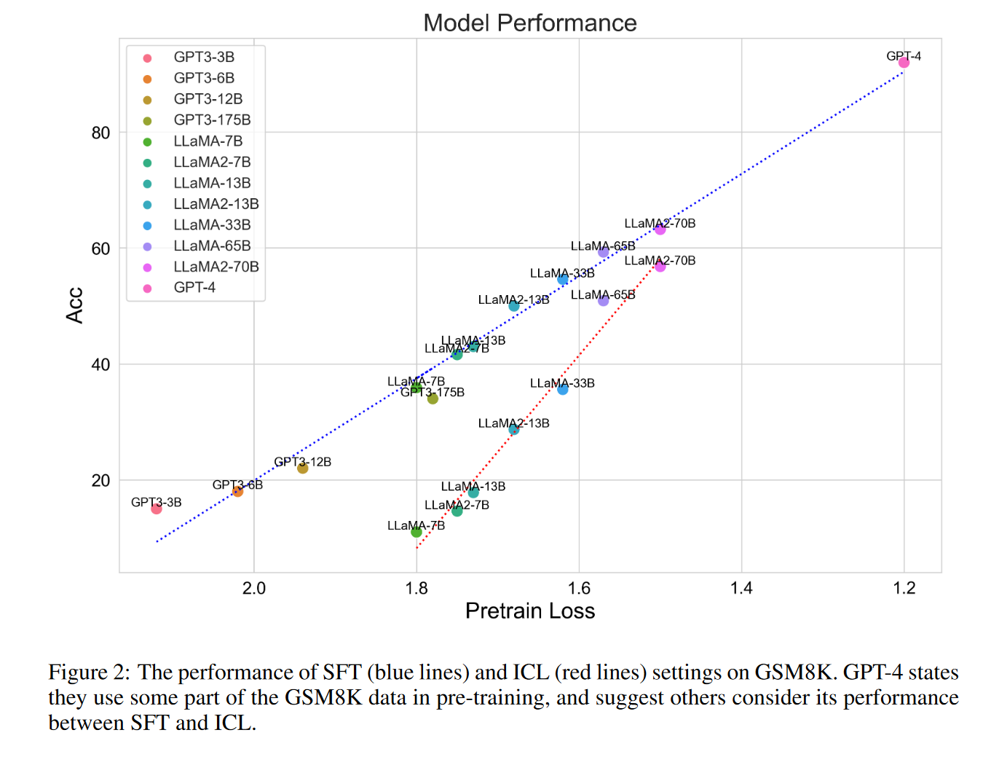

# SCALING RELATIONSHIP ON LEARNING MATHEMATICAL REASONING WITH LARGE LANGUAGE MODELS

## 问题和背景

对于大型语言模型 (LLM) 来说，数学推理是一项具有挑战性的任务，而其与 LLM 能力之间的缩放关系（预训练损失，监督数据量，增强数据量）尚未得到充分探索。本文作者就语言模型的预训练损失，监督数据量和增强数据量和其数学推理能力之间的关系进行了探索。最主要的是作者提出了Rejection sampling Fine-Tuning，即通过采集多样的或着来自多个不同大模型的正确推理路径的组合，在这样的数据微调下的效果比一般的supervised fine-tuning的准确度要高。

对于模型的数学推理能力，作者有以下观点：

1. 随着数据量的增大，模型在数学推理问题上准确度和数据集呈负对数关系。
2. 不论是在STF还是在ICL（in-context learning，few-shot）的条件下，预训练损失越小的模型的推理能力越强。
3. 随着数据量的增大，预训练损失更小的模型在数学推理问题上的准确度的增长速度会衰减的更快，即更好的模型能学到的东西更少。
4. RTF相比于STF能让模型在数学推理问题上的准确度达到收敛的速度更慢。

    

    

    

二，本文方法

本文最主要的贡献就是RTF。作者从觉得影响模型推理能力的关键因素在于**给模型提供正确，合理并且多样化的推理思路**（对于一个受过良好教育的学生来说，每天解决数百个数学应用题很容易，但想出多样化的、有教育意义的数学问题却很难）。而决定RTF最终效果的是**不同的推理路径的数量，**并且作者提供了实验证明。

1.Rejection Sampling Fine-tuning

假设在SFT下语言模型π获得了执行零样本思维链推理的能力，作者使用π来针对每个问题qi，我们生成 k 个候选推理路径和答案 ri1, ri2...rik；接下来作者先筛除了所得答案和真实答案不一致的推理路径，然后对于每个推理路径rij都径包含一个方程列表 ej，作者为每个不同的方程列表选择一个推理路径 rij 作为增强数据，并删除具有相同方程列表的其他推理路径，以消除重复的相似推理路径。需要注意的是，对于等式中存在数字的循序不同的列表，作者也将其当作是不同的推理路径，比如说（1+2=3，3+4=7）和（1+4=5，5+2=7），尽管得到的答案一致。模型知道这些顺序可以交换是有帮助的，但模型很难通过每个问题只有一个推理路径来学习这一点。由此作者定义一个经过RTF采样的数据集如下：

$$
\mathcal{D}_{\pi}^{\prime}=\mathcal{D}\cup{q_{i},r_{ij},a_{i}}_{i,j}
$$

作者比较了llama和llama2在RTF,STF和ICL下的表现，对于RTF作者为每个问题采样了100条路径k=100，在这三种设置下作者分别测试了一次生成和100次生成的结果（self-consistency?），结果如下，实验数据集选用了GSM8K：

从结果可以发现对于33b大小的模型，RTF和SFT相比并没有提高，主要原因来源于33b大小的模型本身就可以产生比较合理的推理路径而不需要再从增强数据中去学习。对于 LLaMA33B-SFT，每个问题平均可以生成 88.7 个正确路径。然而，它过度拟合训练集，并且难以针对训练集问题生成更多样的路径。

作者还分析了$\mathcal{D}_{\pi}^{\prime}$在包含不同数量级的推理路径下，RTF对模型的影响，结果表明，随着推理路径的数量k的增大，模型的表现越好；并且在更多推理路径微调下的模型能针对每个问题产生的不同的推理路径的数量越多，如下：

2.Combining rejection sampling samples from multiple models

合并来自不同模型的推理路径集合，作者获得了两个更大的数据集$\mathcal{D}_{\mathbf{U}13\mathbf{B}}{\prime}$ 和 $\mathcal{D}_{\mathbf{U}33\mathbf{B}}{\prime}$，不同数据集之间的聚合经过了去重：

$$
\mathcal{D}_{\mathbf{U}13\mathbf{B}}{\prime}=\mathcal{D}_{7\mathbf{B}}{\prime}\oplus\mathcal{D}_{7\mathbf{B}2}{\prime}\oplus\mathcal{D}_{13\mathbf{B}}{\prime}\oplus\mathcal{D}_{13\mathbf{B}2}^{\prime}
$$

$$
\mathcal{D}_{\mathrm{U33B}}{\prime}=\mathcal{D}_{\mathrm{U13B}}{\prime}\oplus\mathcal{D}_{\mathrm{33B}}^{\prime}
$$

然而，从单个 SFT 模型采样的推理路径在逻辑上可能是非多样化的。因此，作者期望通过利用从不同模型聚合的拒绝采样推理路径来进一步提高数学推理性能。通过图中的结果，我们可以看到，使用聚合数据集 $\mathcal{D}_{\mathbf{U}13\mathbf{B}}{\prime}$ 和 $\mathcal{D}_{\mathbf{U}33\mathbf{B}}{\prime}$ 可以比使用来自不同模型大小的单个模型的数据集进行微调获得一致更好的性能，如下：

这就解决了上面33b大小模型无法从单个RTF数据集中获益的问题，但是同样的，在65b和77b的模型很难从$\mathcal{D}_{\mathbf{U}13\mathbf{B}}{\prime}$（由13b以下的模型产生的数据）获益，至此有一个结论，如果模型本身就足够好，那么它就需要更多样化的或者来自更大的模型的推理路径数据来提高效果。

三，总结，分析，问题

1. 作者在采样推理路径上做了工作，得出的结论就是用于模型微调的推理路径越多样化越有利于模型的增效。
2. 作者的本文末尾还就自查询增强和自修正增强两种方式进行了探讨

    自查询：作者考虑到这样一种情况推理过程中的不正确结果 会导致原始查询的错误答案，但推理链本身代表了合理的逻辑。因此，作者希望通过事后校验的方式来修正模型的结果。具体地来说，作者通过在给定相应真实推理结果的情况下预测查询（问题）来反向重新格式化 GSM8K，然后在反向任务上微调 LLaMA 模型。

    自修正：作者希望得到一个能对问题的推理路径进行自我修正的模型，为了使 LLaMA 具有修改能力，首先从微调的 LLaMA 模型中采样 K 个推理路径，然后使用模板将查询与采样的推理路径之一连接起来，最后与真实推理进行配对，从而生成修订数据集形成训练样本的路径。（即input:问题+预测推理路径，output:真实的推理路径）

    作者发现这两种做法相比于STF都没有明显的改善。
