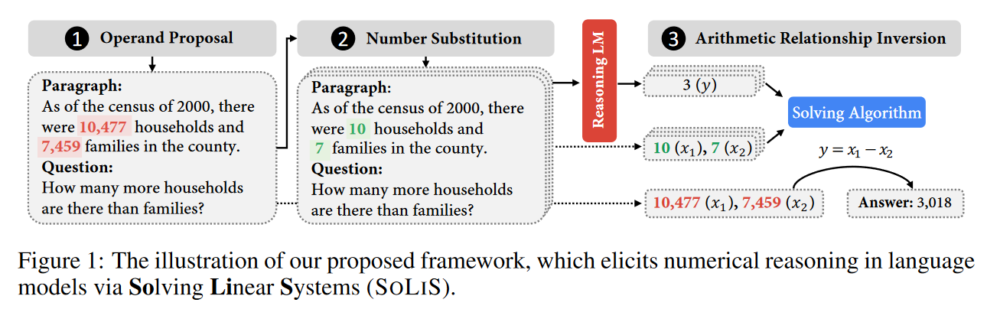

# REFLECTION OF THOUGHT: INVERSELY ELICITING NUMERICAL REASONING IN LANGUAGE MODELS VIA SOLVING LINEAR SYSTEMS

## 背景与问题

尽管目前先进的算数推理语言模型已经可以在**常见和简单的数字推理任务上表现出强大的推理能力，但这些模型很难推广到更广泛的数字推理场景,如大数100,000，浮点数123.34）。**可能的原因在于即使有理数（实数的一个小子集）也很容易构成一个无限的空间，无法被预训练语料库完全覆盖，因此对语言模型构成了重大障碍。这也说明预训练数据集中缺乏对这些复杂数字的端到端的计算过程。但是反过来，相比于复杂数字，现有的llm能很好的理解小整数的简单运算过程，这启发了作者利用简单整数作为“锚点”来引出隐含的算术表达式并将其运用到复杂数字的运算中。

作者利用GPT3(Code-Davinci-002)对算数推理任务进行了初步探索。作者直接给出运算的表达式和结果 如：
					
$$
x_1-x_2+x_3=y
$$

依此来测试llm在求解算数问题上的性能，并对表达式的复杂度进行了限制：只研究四种基本运算，要求不超过4个操作数，每个操作数的整数范围小于10, 000，浮点精度小于4。在few-shot的设置下，GPT3暴露了以下问题：1. 随着数字变得更复杂，即操作数的整数范围或浮点精度增加，预测精度大幅下降。2. 随着算术关系变得更加复杂，即操作数数量增加，预测精度也会急剧下降。

## 本文方法

作者基于反向思考的想法，利用简单的“锚点”数从语言模型中引出在预训练阶段已经学到的算数推理知识。原则上，思维反思允许模型通过在测试时改变输入来揭示潜在的推理过程，因此不需要任何额外的训练或标记数据。此外，该框架可以应用于推理阶段，因此适用于各种零样本，少样本以及微调模型。

该框架可以分为以下三个过程：

### 1. OPERAND PROPOSAL

筛选操作数。从给定的问题上下文中找出和答案强关联的操作数，作者认为llm对用于预测答案的数字的微小变化是敏感的。**通过对段落中的每个数字添加一个小的调整（例如，98.5 → 98.6）然后评估模型预测是否相应变化，依此来确定和答案强关联的操作数。**实际中，作者将问题中出现的每个数字替换 10 次，如果10次输出给出≥ 3 个不同的预测数字，就确定当前测试的数字涉及答案。

### 2. NUMBER SUBSTITUTION

数字替换。作者认为llm可以轻松应对1-20范围内的整数。因此，对于每个被筛选出的数字，他们将这些数字用1-20范围内的整数进行了替换。此外作者还保持了原来计算关系中数字的大小关系，如10, 477 大于 7, 459，因此将 10, 477 对应的替换数设置为大于 7, 459 对应的替换数。作者将替换后的上下文和原问题输入到llm中获取“锚点”答案，需要注意的是获取的“锚点”答案的数量必须大于操作数的数量，以便求解operation的时候有解（满秩方程组）。

### 3. ARITHMETIC RELATIONSHIP INVERSION

算术关系反转。给定操作数x1,x2..xn和答案y，在不加限制的情况下有无数种求解方法。为此，作者将问题的解决空间限制为二元操作符（+，-，，/）的线性组合，同时算式中最多有三个操作符，四个操作数的组合。**因此，作者将不可解的表达归纳问题转化成了线性系统求解问题，其中，操作数，答案和操作符（+，-，，/）构成了线性系统**。

在给定的四种基本运算下，通过将等式两边同乘以除数（如果有除法），可以将y=f(x)转化为以下基本形式，其中**a0-k表示待定的算符**：

$$ 
a_0 \cdot C+a_1 \cdot x_1+a_2 \cdot x_2+a_3 \cdot y+a_4 \cdot x_1 x_2+\ldots+a_k \cdot\left(x_1 x_2 \ldots x_n y\right)=0
$$

将a0,a1..an表示**a**，x0,x1,x2..xn,y表示为**P**，上述等式即为**Pa=0**

接下来，作者介绍了三种从锚点操作数和锚点答案导出表达式的算法：

#### 基于分析的求解算法

为了求解k+1个待定参数**a**，作者根据给定的锚点数为每个问题生成了k+1组锚点答案**y**，

即k+1个k+1元方程组，表示为 **Pa = b**, **为保证方程满秩**，作者为**a**做了约束:

$$
|\boldsymbol{a}|=\sum_{i=0}^k a_i=1
$$

**Pa = b**，如下：

$$
\begin{gathered}
a_{00} \cdot c+a_{01} \cdot x_1+a_{02} \cdot x_2+a_{02} \cdot y_0+a_{04} \cdot x_1 x_2+\ldots a_{0 k} \cdot\left(x_1 x_2 \ldots x_n y_0\right)=0 \\
a_{10} \cdot c+a_{11} \cdot x_1+a_{12} \cdot x_2+a_{12} \cdot y_1+a_{14} \cdot x_1 x_2+\ldots a_{1 k} \cdot\left(x_1 x_2 \cdots x_n y_1\right)=0 \\
\vdots \\
\vdots \\
a_{k0} \cdot c+a_{k 1} \cdot x_1+a_{k 2} \cdot x_2+a_{k 2} \cdot y_1+a_{k k} \cdot x_1 x_2+a_{k k} \cdot\left(x_1 x_2 \ldots x_n y_k\right)=0
\end{gathered}
$$

即，直接求解：

$$
\boldsymbol{a}=(\mathbf{P})^{-1} \boldsymbol{b}
$$

#### 基于搜索的求解算法

针对a = {a0,a1,...an}, 作者限制了a1-n的解空间为{-1，0，1}，而a0的解空间为{-100，-1，0，1，100}，对于每个待选的表达式 f~i~∈F，遍历其对应的锚点答案x~j~∈X，并将fi对应xj的锚点答案记为yij。针对每个f~i~，将目标答案和预测答案的误差记为:

$$
\sum_{j}\operatorname{abs}(\hat{y}_{j}-y_{ij})
$$

并将准确预测，即：

$$
y_j^*==\hat{y}_{i j}
$$

的数量记为:ci，当一个fi具有最小预测误差和最大最缺预测数量时即为求解该问题的最有表达式，具体过程如下：

#### 基于模拟退火的求解算法

根据

$$ 
a_0 \cdot C+a_1 \cdot x_1+a_2 \cdot x_2+a_3 \cdot y+a_4 \cdot x_1 x_2+\ldots+a_k \cdot\left(x_1 x_2 \ldots x_n y\right)=0
$$

作者定义了一个优化目标LH来衡量预测表达式和目标表达式之间的损失，接着按照以下步骤来不断调整表达式直至步数达到最大或LH为0：1. 用{-1，0，1}初始化**a**，并计算初始的LH；2.随机选择a~i~∈**a**并对其施加扰动，即加上或减去一个常数；3. 计算新的LH，如果LH减小，则采用大概率扰动，如果LH增大，则采用小概率扰动，并通过预定义的温度T来平衡，T随着步长的增加而减小；4. 判断是否达到最大步数或者LH=0，达到则停止，否则重复1-3步。**模拟退火未必能求得全局的最优解，但是搜索代价要小得多。**

## 实验结果分析

作者用了三个数据集DROP，AddSub和MultiArith进行验证。将BART，T5以及各类已经针对DROP进行过微调的模型采用本文的框架在DROP数据集上进行微调验证；而对于AddSub和MultiArith，作者采用GPT3(Code-Davinci-002)分别在cot和zero-cot的设置下进行验证。实验结果表明，对于微调设置下的各类模型，采用本文的框架后效果均有显著提升，特别是在采用了**基于搜索的求解算法（穷举，一定能得到最优解，解空间大，搜索耗时）**下模型的效果提升最显著；在直接推理的设置下，两种cot的设置均有提升，特别对zero-cot的提升明显。

## 总结，反思，问题

1. 本文的主要思路在于通过简单数字的求解到抽取原本蕴含在预训练模型中和算数有关的知识并将其运用到复杂数字上以获取准确答案，这说明在预训练的过程中模型就已经能掌握至少简单数字的（+，-，*，/）运算，但是由于缺乏对复杂数字（如大数100,000，浮点数123.34）的端到端运算知识，所以对复杂数字的运算效果较差。因此，本文的框架也是一个“两步走”的方法。
2. 很明显本文的方法无法应对非线性的运算，如求max，sqrt等，需要考虑如何将非这些非线性问题进行转化。
3. 本文并没有提及实验中微调设置下，如何使用本文的框架，是抽取了最优的表达式之后将其作为输入和原问题一块喂给模型？还是作为label让模型推导然后得到答案？锚点答案是通过模型本身获取的还是其他大模型？
4. 基于搜索的求解算法也有疑惑，个人的理解是在限定了解空间的a的基础上依此遍历来得到一个具体的表达式f~i~∈F，然后再判断它是否为最优表达式
5. 采用对固定数字进行扰动的方法来确定和答案强关联的数字是一个可以借鉴的思路。
6. 本文主要提出了一个如何应对复杂数字运算的方法。

## 本文的三个数据集说明

1. DROP（Discrete Reasoning Over Paragraphs）：DROP 是一个阅读理解基准测试，专注于数字推理，有多种答案类型，包括跨度、数字和日期。问答主要涉及数字推理，但也有其他类型问题。

2. AddSub和MultiArith都是MAWPS (MAth Word ProblemS)数据集的子集，其中AddSub的数值推理相对容易，而MultiArith则需要多步数值计算。

‍
